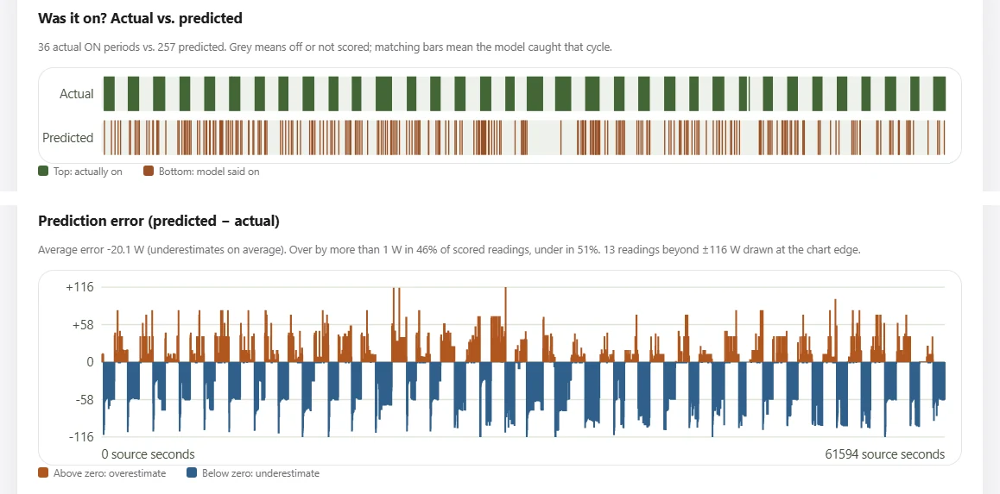

# Does Appliance Detection Transfer Between Homes? A Preregistered Test with REFIT Data

**Current — Energy Profiler** · SaqlineA · October 2026 ·
Code and data pipeline: <https://github.com/SaqlineA/energy-profiler>

## Abstract

Non-intrusive load monitoring (NILM) tries to infer which appliances are running
from a home's total electricity use. I built Current, a small, fully tested NILM
lab:
- a realistic household simulator;
- replay of real recordings from the REFIT dataset;
- simple tree-based models;
- a dashboard that labels every result as tested and trained on real or
  simulated data.

I focused on detecting refrigerator cycles. Before evaluating, I fixed the
protocol, model and pass/fail rule, and kept one REFIT house (House 5) unscored.

The best development model, trained on three real houses, reached F1 0.781 on a
fourth house. On the untouched House 5 it fell to **F1 0.297**. A model trained
only on simulated homes scored **F1 0.686** on the same house. Both models
underestimated fridge energy by 34–41%. A follow-up leave-one-house-out test
across Houses 1–5, also preregistered, found the same pattern in general: with
real training, F1 ranged from 0.339 to 0.520 depending on the held-out house, and
the simulator model detected the fridge better in 4 of 5 houses. Its power
estimates, though, were often worse. The main lesson is methodological: a single
development house badly overstated real-world performance.

## 1. Background and question

NILM is attractive because one meter is cheaper and less intrusive than a
sensor on every appliance (Hart, 1992). It is also hard. Appliances overlap, and
the same appliance draws different power in different homes. Models also tend to
learn the household they were trained in rather than the appliance itself.

The REFIT dataset (Murray et al., 2017) records whole-house ("aggregate") power
and individually metered appliances in 20 UK homes, which makes it a good test
bed for one question:

> *Does training on several real households generalize to an unseen household
> better than training on simulated appliance behaviour?*

## 2. System

Current is a Python (FastAPI, scikit-learn, SQLite) application with a plain
HTML/CSS/JavaScript dashboard.

- **One pipeline for all data.** Simulated, replayed and live sensor readings
  pass through the same steps: timing checks, trailing-window features, model
  estimates, storage and the dashboard.
- **No information leaks from the future.** Features use only the current and
  past readings. Appliance ground truth is used only for scoring, never as a
  model input.
- **Real timestamps and gaps are kept.** Nothing is interpolated, and a blank
  label means unknown, not zero.
- **Test coverage.** 80 automated tests cover timing, energy integration,
  storage, experiment provenance, the simulators and the sensor interface.
- **Sensor-ready.** A local endpoint accepts batched readings from a future
  ESP32 device with token authentication. No physical sensor has been
  validated yet.

The simulator was later calibrated against REFIT Houses 1–4. The fridge was
changed to roughly 85 W, running 25–30 minutes on and 1–2 hours off; v1 had
switched every few minutes. A multi-stage washing machine and realistic
background loads were also added, and each change was checked against
pre-declared realism targets.

## 3. Method

**Data split, declared before scoring.** Each partition is a fixed 10,000-reading
slice (about one day) with a recorded SHA-256 hash:
- **Training:** REFIT House 1, later House 1 plus Houses 3 and 4.
- **Development:** House 2.
- **Final test:** House 5, which was checked for integrity but not parsed or
  scored until the very end.

**Target and models.**
- **Target:** whether the refrigerator is on, at 20 W or more on its own meter,
  and its estimated watts.
- **Candidates:** an always-off baseline, a depth-8 Decision Tree and a 40-tree
  Random Forest. No hyperparameter search was done.

**Metrics.**
- **F1** for detecting ON periods. Accuracy alone is misleading when an appliance
  is usually off.
- **MAE** in watts.
- **Estimated vs measured energy,** integrated only over intervals with valid
  timing.

**Preregistration.** Each experiment's protocol, its single change and its
decision rule were committed to Git before it ran. Each was run once. Failures
were recorded, not tuned away.

## 4. Development: what had to be fixed

**Timing came first, not modelling.** House 1's readings arrive in bursts (gaps
of 1–2 s alternating with 12–14 s). Under a strict 8-second rule only **8**
training windows existed, all fridge-off (v1). A label-blind rule that keeps the
first real reading at least 12.8 s after the previous one, giving a 16-second
cadence, produced **4,368** windows with both classes (v2). The rule never
creates or alters values, so it could later be applied to House 5 without
looking at it.

**Then representation.** Raw-watt summary features confused House 2's different
background load with the fridge. Features measured relative to a trailing
30-minute minimum of the household total (v3) removed most false alarms.
Adding Houses 3 and 4 to training (v4r) then raised every metric.

**Table 1.** Development results on House 2 (3,867 windows; 1,256 fridge-on).

| Run | Features | Trained on | Model | F1 | Accuracy | MAE (W) | Est. / measured kWh |
|---|---|---|---|---:|---:|---:|---:|
| v2 | absolute | House 1 | RF | 0.406 | 28.6% | 52.6 | 0.960 / 0.453 |
| v3 | relative | House 1 | RF | 0.181 | 70.7% | 22.0 | 0.143 / 0.453 |
| v4 | absolute | Houses 1, 3, 4 | RF | 0.132 | 66.0% | 28.1 | 0.108 / 0.453 |
| v4r | relative | Houses 1, 3, 4 | RF | 0.439 | 75.4% | 19.7 | 0.303 / 0.453 |
| **v4r** | relative | Houses 1, 3, 4 | **DT** | **0.781** | **87.1%** | **14.8** | **0.386 / 0.453** |
| — | — | — | Always off | 0.000 | 67.5% | 28.3 | 0 / 0.453 |

The v4r Decision Tree was chosen as the real-data candidate before House 5 was
opened.

## 5. Final test on House 5 (scored once)

**What was frozen beforehand.** The candidate, a synthetic comparator and the
pass/fail rule were all committed before House 5 was read. The synthetic
comparator used the same Decision Tree settings and features, trained on the
research simulator instead.

**Pass/fail rule.** The real-data model passes only if all three hold:
- its F1 is above the always-off baseline;
- its MAE is below always-off;
- its energy estimate is within 0.5–1.5× of the measured energy.

It counts as "better than synthetic" only if its F1 is higher, its MAE lower and
its energy ratio closer to 1.

**Table 2.** House 5 final test (4,335 identical windows; 1,956 fridge-on).

| Model | F1 | Precision | Recall | MAE (W) | Est. / measured kWh |
|---|---:|---:|---:|---:|---:|
| Real-trained DT (Houses 1, 3, 4) | 0.297 | 0.557 | 0.202 | 38.9 | 0.480 / 0.819 (0.59×) |
| **Synthetic-trained DT** | **0.686** | **0.769** | **0.620** | 39.4 | 0.539 / 0.819 (0.66×) |
| Always off | 0.000 | — | 0.000 | 48.5 | 0 / 0.819 |

**Verdict.** The real-data model passed narrowly but was **not** better than the
synthetic model.

**Figure 1.** House 5 in the dashboard.
- **Top strip:** 36 real fridge cycles, with the real-trained model's 257 short,
  scattered "on" predictions below them.
- **Bottom chart:** the prediction error. The model underestimates during every
  real cycle and overestimates between cycles.

## 6. Follow-up: every house held out once

A single test house cannot separate a general pattern from a quirk of that
house. So I preregistered a second test (protocol committed before running).
- **Rotation:** each of Houses 1–5 is held out in turn, and a Decision Tree
  with the frozen v4r settings is trained on the other four.
- **Comparison:** each fold also scores the frozen simulator model and Always
  off on identical windows.

This measures how much results vary between homes. It is not a sealed test:
House 2 chose the settings and House 5 had been scored before.

| Held-out house | Real F1 | Simulator F1 | Real MAE (W) | Simulator MAE (W) | Always-off MAE (W) |
|---|---:|---:|---:|---:|---:|
| 1 | **0.358** | 0.280 | 26.9 | 40.0 | **15.7** |
| 2 | 0.520 | **0.874** | 15.0 | **14.8** | 28.3 |
| 3 | 0.377 | **0.631** | 44.9 | 56.0 | **43.9** |
| 4 | 0.339 | **0.360** | 34.2 | 82.5 | **11.2** |
| 5 | 0.450 | **0.686** | **38.9** | 39.4 | 48.5 |
| Mean | 0.409 | 0.566 | | | |

**Table 3.** Leave-one-house-out fridge detection, 3,687–4,368 windows per
house.

**Verdict (preregistered rules).**
- **Transfer:** real training did **not** transfer reliably. It beat Always off
  on both F1 and MAE in only 2 of 5 houses.
- **Simulator vs real:** the simulator advantage **held** for detection, with a
  higher F1 in 4 of 5 houses.
- **But not for power:** the simulator's power error was the worst of the three
  models in Houses 1, 3 and 4, and it overestimated House 4's fridge energy
  7.7-fold.

**Takeaways.** The simulator seems to teach *when* a fridge runs better than
*how much* power it draws. The real-training score also moved with the choice
of training houses: adding House 5 cut House 2 from 0.781 to 0.520.

## 7. Discussion

**The development score did not transfer.** Recall fell from 71% on House 2 to
20% on House 5. Choosing a model after five comparisons on a single development
house overstated its quality. House 2 may also be unusually easy. When I profiled
the houses, House 2 was the only one whose whole-house total clearly rose
(about 86 W) when its fridge switched on. In Houses 1, 3 and 4 the total barely
moved (a median rise of 0–32 W), so the real training data carried a weak
switch-on signature. This is a measured observation; its cause is untested.

**Why might simulated training transfer better?** The simulator's fridge makes
clean, consistent steps. Real training houses with weak or misaligned steps may
teach a model to expect small, ambiguous signatures. This is a hypothesis. House
5's behaviour was not profiled before scoring, and it is now spent as a test
house.

**A second experiment, on simulated data only,** detected a multi-stage washing
machine (Random Forest, F1 0.701). It found about three quarters of the 2 kW
heating periods but under half of the low-power fill and drain phases. The
preregistered hypothesis was that a longer 8-minute window would help separate
the washer from short kettle-like loads. It did the opposite: F1 fell for both
models.

**Limitations.**
- One final test house, one random seed, and about a day of data per house.
- A single appliance category, and simple models.
- The cleaned REFIT data may contain upstream imputation.
- Whole-house and plug meters can disagree.
- Nothing has been validated on a physical sensor.
- Scores are uncalibrated, and no prediction passed the uncertainty heuristic.

## 8. Next steps

1. **Extend leave-one-house-out** from five houses to more of REFIT's 20 houses
   and longer slices. Then test a preregistered idea from Section 6: simulator
   training for timing, plus a small per-home power calibration.
2. **A published baseline,** such as sequence-to-point learning (Zhang et al., 2018)
   through NILMTK (Batra et al., 2014), so these numbers can be compared with
   known methods.
3. **A newly frozen final-test house,** because House 5 has been used once.
4. **My own real data, collected safely.** Plug-in smart plugs with energy
   monitoring on a few appliances would give per-appliance labels. Several
   appliances on one monitored power strip would give a small "household total"
   to disaggregate, fed into Current's existing sensor endpoint. No mains wiring
   would be involved.

## References

- Batra, N. et al. (2014). NILMTK: An open source toolkit for non-intrusive load
  monitoring. *Proc. 5th ACM International Conference on Future Energy Systems
  (e-Energy).*
- Hart, G. W. (1992). Nonintrusive appliance load monitoring. *Proceedings of the
  IEEE*, 80(12), 1870–1891.
- Murray, D., Stankovic, L., & Stankovic, V. (2017). An electrical load
  measurements dataset of United Kingdom households from a two-year longitudinal
  study. *Scientific Data*, 4, 160122. (Data obtained via Zenodo record 5063428.)
- Pedregosa, F. et al. (2011). Scikit-learn: Machine learning in Python. *Journal
  of Machine Learning Research*, 12, 2825–2830.
- Zhang, C., Zhong, M., Wang, Z., Goddard, N., & Sutton, C. (2018).
  Sequence-to-point learning with neural networks for non-intrusive load
  monitoring. *Proc. AAAI Conference on Artificial Intelligence.*
