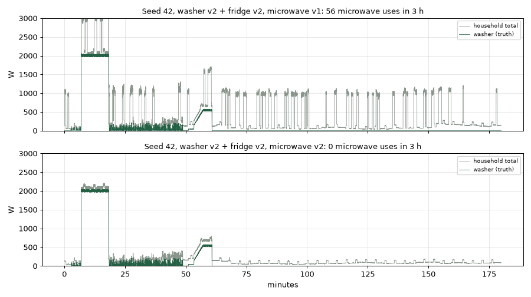

# Research simulator microwave v2

Written before the code change. Step 15F found that the research simulator's
microwave starts with a 0.8% chance every second, about 690 uses per simulated
day. It crowds the household total and can hide or mimic washer stages. This is
a realism fix, not an ML change.

## Real behaviour (REFIT Houses 2–4; House 1 has no microwave; House 5 retired)

The channels, from NILMTK metadata, are House 2 Appliance5 and Houses 3–4
Appliance8. The data is the existing 20 MB slices in `data/refit/washer/`. A
*use* is a run of readings above 100 W (the existing microwave threshold),
joined across pauses of up to 60 s, so a magnetron cycling at low power still
counts as one use.

| | House 2 | House 3 | House 4 |
|---|---:|---:|---:|
| Days covered | 26.5 | 26.0 | 21.7 |
| Uses per day | 5.1 | 1.3 | 5.1 |
| Duration, s p10 / p50 / p90 | 14 / 77 / 166 | 18 / 33 / 148 | 26 / 115 / 294 |
| Watts while on, p50 | 1,175 | 1,358 | 1,134 |
| Standby, W p50 | 0 | 0 | 2 |

Uses cluster in the daytime and evening (UTC).

## v2 design

- **Opt-in:** `RealisticHome(microwave='v2')` and
  `realistic_sessions(..., microwave='v2')`. The default v1 stays byte-identical.
- **Own random generator,** seeded from the home's seed.
- **Per home:**
  - Power: 1,000–1,400 W, with the existing ±3.5% noise while on.
  - Rate: 1–6 uses per day, as a constant per-second start chance.
- **Per use:** a duration log-uniform between 20 and 300 s, which gives a median
  of about 77 s.
- **Manual switches** in the dashboard still work.
- **The `household` dashboard profile** switches to microwave v2, alongside
  fridge v2 and washer v2.

## Acceptance (decided now)

Simulate 14 days for each of two homes (seeds 42 and 1039). v2 passes if:
- Uses per day are 1–6.
- Duration p50 is 30–120 s and p90 is at most 300 s.
- Watts while on, p50, is 1,000–1,400 W.
- Standby is 0 W.

v1 fingerprints must not change, and each measure should be closer to the real
range than v1.

**Known simplifications:** no time-of-day pattern, no low-power magnetron
cycling, no standby clock load, and the same rate on every day.

## Result (2026-09-26)

Two homes were each simulated for 14 days. Every check passed on the first
run, with no revisions:

| | Target | v1 seed 42 / 1039 | **v2 seed 42 / 1039** |
|---|---|---|---|
| Uses per day | 1–6 | 494 / 488 | **2.0 / 2.8** |
| Duration p50 | 30–120 s | 52 / 53 s | **77 / 73 s** |
| Duration p90 | ≤ 300 s | 83 / 83 s | **227 / 182 s** |
| Watts while on, p50 | 1,000–1,400 | 920 / 1,249 | **1,394 / 1,232** |
| Standby p50 | 0 W | 0 | **0** |

Across the four uses-per-day and duration measures, v1 was about 490 uses a
day, roughly 100 times too many, with durations about 1.5× too short. v2 lands
within the real ranges.

**Other checks:**
- v1 fingerprints are unchanged (`test_realistic.py`).
- `test_microwave_v2_is_occasional_and_bounded` checks the rate, the 20–300 s
  durations and the power range.
- The `household` dashboard profile now uses fridge, microwave and washer v2,
  which `test_project.py` checks.

**Effect on washer visibility.** With microwave v1, one 3-hour window had 56
microwave bursts of about 1 kW, which buried the washer's low-power stages.
With v2 there were none in that window, and fill, heat, wash flicker, drain and
the spin ramp are all visible in the household total:

This is a quiet window, not proof that washer phases are easy to detect. Real
homes add other loads; House 3's background was about 400 W. The simulator
also still has a fixed 80 W "unknown" load for 40 s of every 4 minutes, which
shows as small regular bumps. Both matter for the future washer ML
experiment, which will need its own preregistration.
