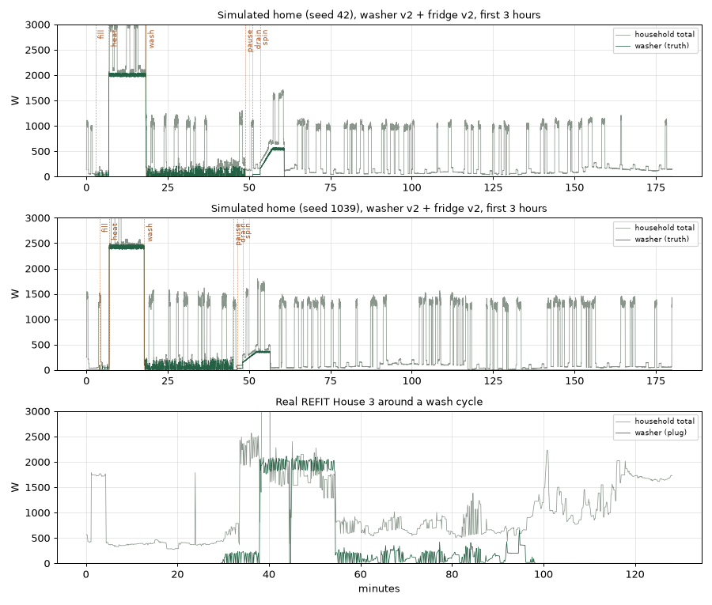

# Simulated washing machine v2: design (Step 15B)

Written and committed before implementation. It is based on the real profile in
[washing-machine-profile.md](washing-machine-profile.md). The goal is a
reasonable educational multi-stage appliance, not a copy of any one real washer.

## Compatibility

- `RealisticHome(washer=False)` (the default) and `washer=True` (the existing
  compressed v1 washer) stay byte-identical, so every earlier seed, test and
  report still reproduces.
- The new model is opt-in: `washer='v2'`, also accepted by
  `realistic_sessions(..., washer='v2')`.
- v2 draws from **its own seeded random generator**, derived from the home's
  seed. Adding it never changes the lamp, fridge, microwave, background or noise
  values. The household total with the washer is exactly the total without it
  plus the washer's watts, apart from rounding.
- The research simulator's washer device (`WASHER`, 10 W threshold) and the live
  three-appliance model are unchanged. No ML detection is added in Step 15.

## State machine

The only allowed order is:
`off → fill → heat → wash → pause → drain → spin → off`.

Each state's duration and settings are drawn once, when the state starts. One
sample is one simulated second.

| State | Duration | Power | Variation | Based on |
|---|---|---|---|---|
| **off** | Until the next scheduled start | 0 W | none | REFIT idle is 0 W |
| **fill** | 2–5 min | Inlet valve 8–12 W, plus a slow tumble every 20–40 s lasting 5–10 s at 40–90 W | ±5% noise | The low flicker before heating |
| **heat** | 8–18 min | One heater level per home, 2,000–2,500 W | ±2% noise | 1.9–2.6 kW blocks lasting 5–18 min in 37/38 cycles |
| **wash** | 15–60 min | Drum reversals: on 8–15 s at 100–250 W, off 3–8 s at about 5 W | ±5% noise | The dense 20–250 W flicker |
| **pause** | 1–5 min | 2 W (electronics) | none | Near-zero pauses |
| **drain** | 1–3 min | Pump at 30–60 W (drawn per cycle) | ±5% noise | Low steady segments |
| **spin** | 3–10 min | Rises from 150 W to a peak of 300–550 W over the first half, then holds | ±5% noise | The 250–550 W final spin |

**Schedule:**
- The first cycle starts 2–10 minutes into a session, so it can be seen in the
  dashboard. This is a demo convenience, not a realistic habit.
- After each cycle ends, the next one starts 36–120 hours later, which averages
  about 0.3 cycles per day (REFIT: 0.19–0.57).
- A full cycle lasts about 30–100 minutes (REFIT p50: 32–140) and uses about
  0.3–0.8 kWh (REFIT p50: 0.3–0.9).

**Saved state:**
- `RealisticHome.wash_stage` holds the current state name.
- Each v2 simulator reading carries `washing_machine_stage`, which is stored in a
  new nullable SQLite column (an additive migration, like `washing_machine`).
- CSV export gains that column.
- Replay and sensor readings leave it empty.

**Dashboard:**
- A new simulation profile, *Realistic v2: real-data fridge + washing machine*,
  uses fridge v2 and washer v2 together. It is a demo profile, not an experiment.
- Its washer card shows running or off, the phase, the measured watts and the
  minutes into the cycle.
- The existing *expanded* profile keeps the v1 washer.

## Acceptance checks (decided now)

Simulate 14 days for each of two homes (seeds 42 and 1039), and profile the
washer channel with `washer_profile.profile` using the same thresholds as for
real data. v2 passes if all of these hold:

- Cycle length p50 is 30–140 min.
- Peak p50 is 1,900–2,700 W.
- Every cycle includes heating, with a heat-band p50 of 5–18 min.
- Energy per cycle p50 is 0.3–0.9 kWh.
- Idle power p50 is 0 W.
- There are 0.15–0.65 cycles per day.
- Non-heating active watts: p50 is 60–140 W and p99 is at most 600 W.

**Tests:**
- The states run in the allowed order, with no impossible jumps such as
  `off → spin`.
- Every state's watts stay inside its range.
- v1 and no-washer sessions are byte-identical to before.
- The household total includes the washer.
- The stage is saved in storage.
- A cycle finishes and the washer returns to off.

## Known simplifications

- There is one wash and one final spin. Real machines repeat rinse, drain and
  short spins several times.
- Every cycle heats; some real cycles are cold washes.
- Drum reversals are regular. Real motor current also has
  startup surges and load-dependent variation.
- There is no washer-dryer, no standby display load, and no link between the
  washer schedule and time of day.

## Implementation and results (Step 15C–15F, 2026-09-26)

`WasherV2` in `realistic.py` follows the design above. The four existing modes
(no washer, v1 washer, fridge v2, and v1 washer with fridge v2) were verified
byte-identical to the previous code, and their fingerprints are pinned in
`test_realistic.py`.

### Acceptance checks

Two homes (seeds 42 and 1039) were each simulated for 14 days and profiled
with `washer_profile.profile`.

**First run (as designed): two of the preregistered checks failed.**

- **The heat-band check failed (50–58 min, target 5–18).** This is a
  profiler flaw, not a simulator one. `stages()` folds any band shorter than
  60 s into the stage before it. The simulated wash stage's 8–15 s drum bursts
  were therefore counted as part of the heating stage that precedes them.
  The simulator's heat stage itself is 8–18 min by construction. A direct
  measure, *minutes above 1 kW*, was added to the profiler and run on both
  real and simulated data. Real p50 values are 6.0, 17.3, 13.6 and 14.7 min;
  the simulator gives 13–14 min.
- **The non-heating active watts check failed (p50 180 W, target 60–140 W).**
  This was a real calibration miss: the wash bursts were too strong.
  **One revision** was made: wash bursts went from 100–250 W to **40–200 W**.

**After that single revision, every check passes:**

| Check | Target | Seed 42 | Seed 1039 |
|---|---|---:|---:|
| Cycle length p50 | 30–140 min | 74.6 | 66.9 |
| Peak p50 | 1,900–2,700 W | 2,045 | 2,476 |
| Heating in every cycle | yes | 4/4 | 4/4 |
| Minutes above 1 kW, p50 | 5–18 (real 6–17) | 14.3 | 12.8 |
| Energy per cycle p50 | 0.3–0.9 kWh | 0.6 | 0.6 |
| Idle power p50 | 0 W | 0 | 0 |
| Cycles per day | 0.15–0.65 | 0.29 | 0.29 |
| Non-heating active W, p50 / p99 | 60–140 / ≤600 | 127 / 562 | 130 / 395 |

The preregistered heat-band measure still reads high because of the flaw
described above. It is left unchanged, and the direct measure is reported
alongside it.

### Tests (15D)

- The stages run in exactly `off → fill → heat → wash → pause → drain → spin → off`,
  and every transition is in `WASHER_V2_NEXT`, so a jump like `off → spin` is
  impossible.
- Every sample's watts stay inside its stage's bounds, since the noise is bounded.
- The lamp, fridge and microwave values are identical with and without the washer.
- The household total with the washer equals the total without it plus the
  washer's watts, to within 0.01 W of rounding.
- The cycle timer resets when a cycle finishes.
- In the app, the `household` profile runs washer v2, and `/api/state` reports
  its stage, model and cycle minutes.
- The CSV export includes `washing_machine_stage`, from `off` through to the
  live stage.

### Dashboard (15E)

- A new profile, **Realistic v2: real-data fridge + washing machine**, has its
  own description.
- In the Appliances section, a washer card shows running or off, the phase, the
  measured watts, the minutes into the cycle and the model version. It is
  labelled *simulated, not ML-detected*.
- Live check: at 179 s into a session it showed Running · Fill · 12 W · 0.2 min.
- The *expanded* profile keeps the v1 washer, and the card says "v1 · compressed demo".

### Is the pattern recognizable in the household total? (15F)

- **Heating is the signature.** It is a 2.0–2.5 kW block lasting 10–15
  minutes and carries **79–84% of the washer's energy**. It stands out clearly
  in the simulated total, as it does in real House 3.
- **The final spin is visible** as a steady rise to 300–550 W.
- **Fill, wash and drain (below 200 W) are nearly invisible** under the other
  loads, in both the simulation and real House 3. Detecting those phases from
  the household total will be much harder than detecting heating.
- **New finding: the research simulator's microwave is unrealistic.** It
  starts a 700–1,500 W burst roughly every 2 minutes (0.8% per second), which
  crowds the total and could hide or mimic washer stages. It is recorded here
  and **not changed**, to keep one variable at a time, but it should be fixed
  before a washer ML experiment.
- The simulated background load (about 50–120 W) is lower than real House 3's
  (about 400 W).

No ML detection was added. A separate, preregistered washer experiment comes next.
