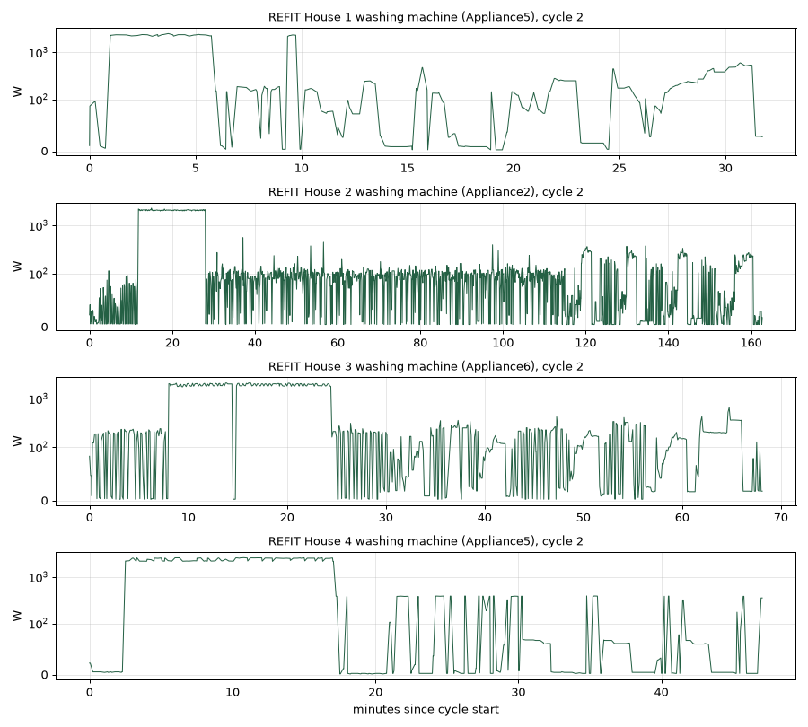

# Real washing-machine behaviour (Step 15A)

This describes real washing machines in REFIT Houses 1–4 before any simulator
change. Nothing was trained. House 5 is retired; `washer_profile.py` refuses it.

## Data

With your approval, the first 20 MB of `CLEAN_House{1,2,3,4}.csv` were
downloaded from [Zenodo 5063428](https://zenodo.org/records/5063428) into
ignored `data/refit/washer/`. That is about 22–26 days per house. The earlier
10,000-reading slices contained only one complete wash cycle, which was not
enough.

The washer channels come from NILMTK's REFIT metadata, where meter N
corresponds to REFIT column Appliance(N−1):

| House | Channel | NILMTK label | Used |
|---|---|---|---|
| 1 | Appliance5 | Washing Machine | ✅ (Appliance4 is a separate washer-dryer, not profiled) |
| 2 | Appliance2 | Washing Machine | ✅ |
| 3 | Appliance6 | Washing Machine | ✅ |
| 4 | Appliance5 | Washing Machine (1) | ✅ |
| 4 | Appliance6 | Washing Machine (2) | ⚠️ Questionable: never above ~150 W, idles at 5 W, and runs for up to 30 h. It does not behave like a washer, so it is reported but excluded from the design. |

```powershell
python washer_profile.py
```

**Method.**
- A reading counts as active above 10 W.
- A *cycle* is a run of active readings joined across pauses of up to 15
  minutes. A sampling gap longer than 2 minutes ends the cycle instead of
  bridging it. Runs shorter than 10 minutes or peaking below 100 W are ignored.
- Power bands label the stages: pause (below 10 W), motor (10–300 W), spin
  (300–1,000 W) and heat (above 1,000 W). A band has to last at least a minute
  to count as a stage.
- These bands are descriptive only. REFIT has no phase labels.

## Results

| | House 1 | House 2 | House 3 | House 4 (1) | House 4 (2) ⚠️ |
|---|---:|---:|---:|---:|---:|
| Days covered | 25.2 | 26.5 | 26.0 | 21.7 | 21.7 |
| Cycles (per day) | 13 (0.52) | 15 (0.57) | 5 (0.19) | 5 (0.23) | 14 (0.64) |
| Cycle length, min p50 (p10–p90) | 32 (32–74) | 140 (91–172) | 65 (60–68) | 47 (45–54) | 111 |
| Peak W, p50 | 2,427 | 2,327 | 2,046 | 2,620 | 143 |
| Cycles with heating (>1 kW) | 13/13 | 14/15 | 5/5 | 5/5 | 0 |
| Heat-band stage minutes, p50 | 10 | 18 | 18 | 16 | 0 |
| Minutes above 1 kW (direct), p50 | 6.0 | 17.3 | 13.6 | 14.7 | 0 |
| Energy per cycle, kWh p50 | 0.3 | 0.9 | 0.5 | 0.6 | 0.2 |
| Off/idle W, p50 | 0 | 0 | 0 | 0 | 5 |
| Non-heating active W, p10 / p50 / p90 / p99 | 26 / 128 / 355 / 549 | 19 / 110 / 221 / 332 | 18 / 136 / 235 / 568 | 46 / 68 / 392 / 442 | — |
| Stages per cycle, p50 | 8 | 3 | 5 | 10 | 1 |
| Largest step within a cycle, p50 | 2,324 W | 2,050 W | 1,899 W | 2,214 W | 94 W |



## What real cycles look like

The four genuine machines share one shape:

1. **Start or fill:** a few minutes of low, flickering power (0–100 W) as water
   enters and the drum turns slowly.
2. **Heat:** one flat block at about **1.9–2.6 kW** for **5–18 minutes**, in
   37 of 38 cycles. This is most of each cycle's energy, and switching the
   heater on or off is the largest step (about 2 kW, within one reading).
3. **Wash:** a long stretch of rapid on/off motor bursts, roughly 20–250 W,
   switching every few seconds as the drum reverses. At REFIT's 7 s sampling it
   looks like dense flicker.
4. **Rinse, drain and pause:** mixed low-power segments with near-zero pauses.
   Real machines repeat rinse, drain and short spins several times, which is why
   Houses 1 and 4 show 8–10 stages.
5. **Final spin:** a rise to about **250–550 W** over a few minutes at the end.
   That is well below the 300–1,000 W "spin" band, so the spin minutes in the
   profile are undercounted.

Machines are off (0 W) most of the time and run about **0.2–0.6 cycles per day**.

## Limitations

- There are 38 genuine cycles from four machines over about 3–4 weeks each, a
  small sample from one season.
- The stage bands are heuristics. Heating is unambiguous, but motor, spin and
  drain overlap in power, and REFIT's roughly 7 s sampling (bursty in Houses 1
  and 4) smooths or aliases fast drum reversals.
- The cleaned REFIT data may contain upstream imputation.
- House 1's washer-dryer (Appliance4) and House 4's questionable second channel
  are not part of the design.
- Nothing here says how visible the washer is in the household total. That
  depends on the other loads, and (as with the fridge) the whole-house clamp
  and the appliance plug may not agree.
